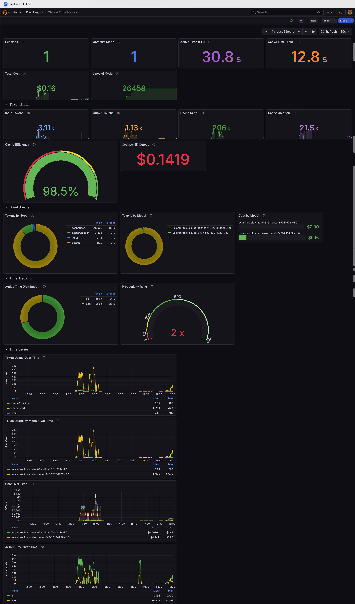

# Claude Code Monitoring Stack

A complete, production-ready monitoring solution for tracking Claude Code usage with OpenTelemetry, Prometheus, and Grafana. Get instant visibility into your AI-assisted development with a beautiful dashboard featuring 22 visualization panels.

  

## Example Dashboard




## Features

✨ **22 Visualization Panels** organized in 4 collapsible sections  
📊 **Real-time Metrics** - Token usage, costs, cache efficiency  
🥧 **Visual Breakdowns** - Pie charts, gauges, time series graphs  
⚡ **One Command Setup** - Get running in under 2 minutes  
🔒 **Privacy First** - All data stays on your machine  
🌍 **Cross-Platform** - Works on macOS, Linux, and Windows  

## Quick Start

### Prerequisites
- [Docker Desktop](https://www.docker.com/products/docker-desktop/) (or Docker + Docker Compose on Linux)
- [Claude Code CLI](https://claude.com/product/claude-code)

### Installation

1. **Clone the repository**
```bash
git clone <your-repo-url>
cd cc-monitoring
```

2. **Start the monitoring stack**
```bash
docker-compose up -d
```

3. **Configure Claude Code**

Add to your Claude Code settings file:
- **macOS/Linux**: `~/.claude/settings.json`
- **Windows**: `%USERPROFILE%\.claude\settings.json`

```json
{
  "env": {
    "CLAUDE_CODE_ENABLE_TELEMETRY": "1",
    "OTEL_METRICS_EXPORTER": "otlp",
    "OTEL_LOGS_EXPORTER": "otlp",
    "OTEL_EXPORTER_OTLP_PROTOCOL": "grpc",
    "OTEL_EXPORTER_OTLP_ENDPOINT": "http://localhost:4317"
  }
}
```

4. **Restart Claude Code** to apply changes

5. **Access the dashboard**
   - Open http://localhost:3000 in your browser
   - Login with: `admin` / `admin` (you'll be prompted to change the password)
   - The dashboard is automatically provisioned and ready to use!

## Dashboard Overview

The dashboard includes **22 visualization panels** organized into **4 collapsible sections**:

### 📊 Token Stats
- Input/output tokens with trends
- Cache read/creation metrics
- Cache efficiency gauge (shows your cache hit ratio %)
- Cost per 1K output tokens

### 🥧 Breakdowns
- **Pie Charts**: Tokens by type, tokens by model
- **Bar Gauge**: Cost breakdown by model
- Model usage trends over time

### ⏱️ Time Tracking
- Active time distribution (CLI vs user)
- Productivity ratio gauge (shows your AI multiplier)
- Session and activity metrics

### 📈 Time Series
- Token usage trends with model breakdown
- Cost over time with detailed attribution
- Active time patterns and productivity insights

## What's Monitored

| Metric | Description |
|--------|-------------|
| **Sessions** | Number of Claude Code sessions |
| **Tokens** | Input, output, cache read, cache creation |
| **Cost** | Total API costs in USD with model breakdown |
| **Active Time** | CLI active time and user active time |
| **Cache Efficiency** | Percentage of tokens served from cache |
| **Tool Decisions** | Number of code edit tool decisions |
| **Lines of Code** | Code changes tracked |
| **Productivity Ratio** | CLI time vs user time (your AI multiplier) |

## Architecture

The monitoring stack consists of three Docker containers:

```
┌─────────────┐      ┌──────────────────┐      ┌────────────┐      ┌─────────┐
│ Claude Code │─────>│ OTel Collector   │─────>│ Prometheus │─────>│ Grafana │
│             │ OTLP │ (4317/4318)      │ Pull │ (9090)     │ Query│ (3000)  │
└─────────────┘      └──────────────────┘      └────────────┘      └─────────┘
```

1. **OpenTelemetry Collector** (ports 4317/4318): Receives telemetry from Claude Code
2. **Prometheus** (port 9090): Stores time-series metrics
3. **Grafana** (port 3000): Visualizes data with pre-configured dashboard

## Optional Configuration

### Multi-Team Tracking

Add custom attributes to track usage by team, department, or project:

```json
{
  "env": {
    "CLAUDE_CODE_ENABLE_TELEMETRY": "1",
    "OTEL_METRICS_EXPORTER": "otlp",
    "OTEL_LOGS_EXPORTER": "otlp",
    "OTEL_EXPORTER_OTLP_PROTOCOL": "grpc",
    "OTEL_EXPORTER_OTLP_ENDPOINT": "http://localhost:4317",
    "OTEL_RESOURCE_ATTRIBUTES": "team.id=platform,department=engineering,project=ai-tools"
  }
}
```

Then create Grafana dashboard filters based on these attributes.

## Common Commands

```bash
# View logs
docker-compose logs grafana
docker-compose logs prometheus
docker-compose logs otel-collector

# Follow logs in real-time
docker-compose logs -f

# Restart a service
docker-compose restart grafana

# Stop everything
docker-compose down

# Stop and remove all data (including stored metrics)
docker-compose down -v

# Check service status
docker-compose ps
```

## Troubleshooting

### Dashboard shows "No data"

1. **Check Claude Code telemetry is enabled**
   ```bash
   # Verify settings.json contains the env variables
   cat ~/.claude/settings.json  # macOS/Linux
   ```

2. **Verify containers are running**
   ```bash
   docker-compose ps
   # All three services should show "Up"
   ```

3. **Check OTel Collector is receiving data**
   ```bash
   docker-compose logs otel-collector | grep -i "metric"
   ```

4. **Verify Prometheus is scraping**
   - Visit http://localhost:9090
   - Go to **Status** → **Targets**
   - The `otel-collector` target should show "UP"

5. **Check Prometheus has Claude Code metrics**
   - Visit http://localhost:9090
   - Go to **Graph** tab
   - Search for `claude_code_` - you should see metrics

6. **Ensure Claude Code was restarted** after changing settings

### Connection refused errors

All containers must be on the same Docker network. The `docker-compose.yml` creates a `monitoring` network automatically. Check with:
```bash
docker network ls
docker network inspect cc-monitoring_monitoring
```

### Dashboard not loading

1. Check Grafana logs:
   ```bash
   docker-compose logs grafana | grep -i error
   ```

2. Verify dashboard provisioning:
   ```bash
   docker-compose logs grafana | grep -i "provision"
   ```

3. Reset Grafana (will lose custom changes):
   ```bash
   docker-compose down
   docker volume rm cc-monitoring_grafana-data
   docker-compose up -d
   ```

## Data Retention

- **Metrics**: Stored in Docker volume `prometheus-data`
- **Grafana settings**: Stored in Docker volume `grafana-data`
- **Persistence**: Data survives container restarts
- **Cleanup**: Use `docker-compose down -v` to remove all data

By default, Prometheus retains metrics for 15 days. To change this, modify `docker-compose.yml`:

```yaml
prometheus:
  command:
    - '--storage.tsdb.retention.time=30d'  # Keep data for 30 days
```

## Customizing the Dashboard

The dashboard is provisioned from `grafana-provisioning/dashboards/claude-code-dashboard.json`.

**To customize:**

1. Make changes in the Grafana UI (http://localhost:3000)
2. Export the dashboard:
   - Click the dashboard settings (gear icon)
   - Select **JSON Model**
   - Copy the entire JSON
3. Save to `grafana-provisioning/dashboards/claude-code-dashboard.json`
4. Restart Grafana: `docker-compose restart grafana`

**Important**: Export as traditional Grafana JSON format (starts with `{"title": ...}`), not Kubernetes API format.

## Privacy & Security

- ✅ **All data stays local** - Nothing is sent to external servers
- ✅ **User prompts are redacted** - Only usage metrics are collected
- ✅ **Opt-in telemetry** - Must be explicitly enabled
- ✅ **Open source stack** - All components are auditable

For production use:
1. Change the default Grafana password (prompted on first login)
2. Consider adding authentication to the OpenTelemetry Collector
3. Set up regular backups of the Docker volumes
4. Review and adjust Prometheus retention settings

## Platform Support

This monitoring stack works on:
- **macOS** (Intel and Apple Silicon)
- **Linux** (any distribution with Docker support)
- **Windows** (with Docker Desktop or WSL2)

All commands use standard Docker Compose syntax that works across platforms.

## Uninstalling

To completely remove the monitoring stack:

```bash
# Stop and remove containers, networks
docker-compose down

# Remove stored data (metrics and Grafana settings)
docker volume rm cc-monitoring_prometheus-data cc-monitoring_grafana-data

# Or use the combined command
docker-compose down -v
```

## Contributing

Contributions are welcome! See [CONTRIBUTING.md](CONTRIBUTING.md) for guidelines.

## Credits

Dashboard design inspired by [mikelane's Claude Code metrics dashboard](https://gist.github.com/mikelane/f6c3a175cd9f92410aba06b5ac24ba54).

---

**Questions?** Open an issue on GitHub or check the [CLAUDE.md](CLAUDE.md) for technical details.
